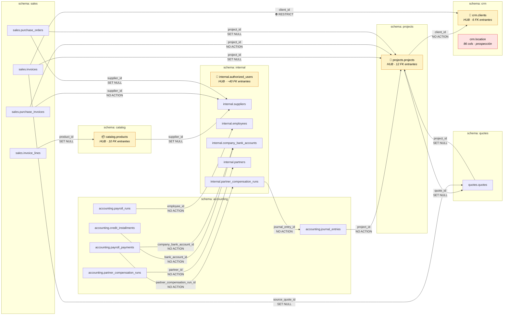

# ERD Cross-Schema — NEXO AV (Bloque A Crítico)

> Generado: 2026-03-26
> Solo FKs de negocio críticas (Bloque A: 19 relaciones)
> Bloque C (31 FKs de auditoría created_by/assigned_to a authorized_users) omitido por claridad

## Diagrama

## Leyenda

| Estilo | Significado |
|---|---|
| Nodo amarillo | Tabla hub (muchas FK entrantes) |
| Nodo rojo | Tabla con riesgo corregido (crm.location — era CASCADE, ahora SET NULL) |
| Flecha `⛔ RESTRICT` | No se puede borrar el registro padre si hay hijos |
| Flecha `SET NULL` | El hijo sobrevive con columna FK = NULL |
| Flecha `NO ACTION` | Validación diferida o sin acción especial |
| Flecha `CASCADE` | El hijo se borra si se borra el padre (NO usada en Bloque A) |

## Tablas hub — conteo de FK entrantes

| Tabla | Schema | FK Entrantes (total cross-schema) | Protección recomendada |
|---|---|---|---|
| authorized_users | internal | ~40 | Nunca borrar; usar `is_active = false` |
| projects | projects | ~12 | CASCADE solo para hijos directos dentro del mismo schema |
| products | catalog | ~10 | SET NULL en invoice_lines; NO ACTION en compras |
| clients | crm | ~6 | RESTRICT en sales.invoices; NO ACTION en proyectos |

## Notas

- `crm.location` no aparece en el Bloque A (no tiene FKs salientes hacia tablas hub del Bloque A)
  pero se incluye en el diagrama como referencia al riesgo corregido.
- Las 31 FKs del Bloque C (`created_by`, `assigned_to` → `authorized_users`) están omitidas.
  Añadirlas convertiría `authorized_users` en el nodo central de prácticamente toda la BD.
- `public.product_companion_rules` tiene ON DELETE CASCADE hacia `catalog.products` — correcto
  (las reglas de acompañante son hijos directos del producto).
